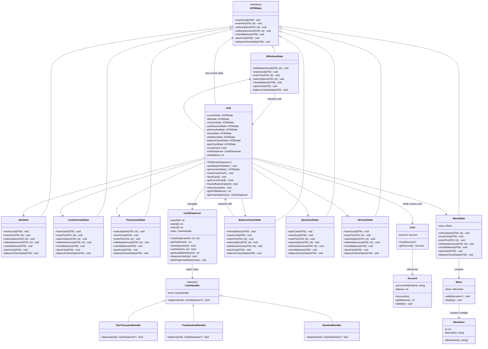

# ATM Machine LLD - System Design

## UML Class Diagram



## Design Patterns Used

### 1. **State Pattern** 
- **Purpose**: Encapsulate different ATM states and allow state transitions
- **Implementation**: `IATMState` interface with 8 concrete state classes
- **Benefits**: Clear state-specific behavior, easy to add new states

### 2. **Chain of Responsibility Pattern**
- **Purpose**: Handle cash dispensing with different denominations
- **Implementation**: `CashHandler` abstract class with handlers for ₹2000, ₹500, ₹100
- **Benefits**: Flexible, extensible, separation of concerns

### 3. **Composition Pattern**
- **Purpose**: ATM composes multiple state objects and delegates behavior
- **Components**: Menu, MenuItem, Card, Account

## State Transitions

```
START (Idle State)
  ↓
insertCard() → Card Inserted State
  ↓
enterPin() → PIN Inserted State
  ↓
selectOption(1 or 2)
  ├→ Withdraw State → Menu State
  └→ Balance Check State → Menu State
  ↓
ejectCard() → Idle State
```

## Class Responsibilities

| Class | Responsibility |
|-------|-----------------|
| **ATM** | Manages states, holds current card, manages cash balance |
| **IATMState** | Define interface for all state behaviors |
| **IdleState** | Initial state, only accepts card insertion |
| **CardInsertedState** | Waits for PIN entry |
| **PinInsertedState** | Presents menu options |
| **MenuState** | Displays menu and handles option selection |
| **WithdrawState** | Validates and dispenses cash |
| **BalanceCheckState** | Displays account balance |
| **EjectCardState** | Ejects card and returns to idle |
| **NoCashState** | ATM is out of service (no cash) |
| **CashDispenser** | Manages cash inventory and dispensing |
| **CashHandler** | Chain handlers for different denominations |
| **Card** | Represents user's bank card |
| **Account** | Represents user's bank account |
| **Menu** | Displays options to user |

## Key Features

✅ **State Management**: Clear separation of state-specific behaviors  
✅ **Cash Handling**: Chain of Responsibility for denomination flexibility  
✅ **Account Validation**: Before dispensing, validates both ATM and account balance  
✅ **Transaction Recording**: Debits account only after successful cash dispensing  
✅ **User Experience**: Menu-driven interface with proper prompts  
✅ **Error Handling**: Graceful handling of invalid operations per state
